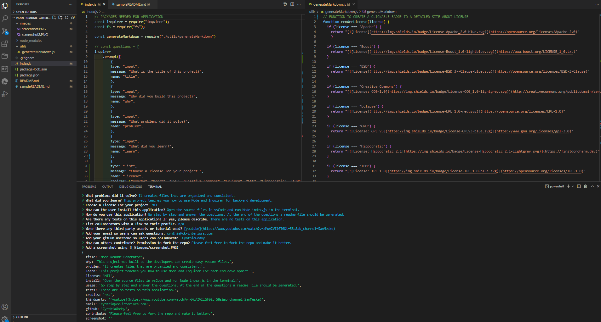

# asdf

## Description
sadfq
qwer
qwe

## Table of Contents
- [License](#license)
- [Installation](#installation)
- [Usage](#usage)
- [Tests](#tests)
- [Credits](#credits)
- [Questions](#questions)
- [Contribute](#contributors)
- [Screenshot](#Screenshot)

## License
For detailed license information click on the badge below.

This project is licensed under: Apache License Version 2.0, January 2004

## Installation
To install or test this application, please follow the steps below:
qwer

## Usage
To use this application, please follow the steps below:
qwer

## Tests
To run a test on this application, please follow the steps below:
qwer

## Credits
Credits & Third-party Sources used are:
qwer
qwer

## Questions
If you have any questions about this project, please contact me directly at qwer. 
You can view more of my projects at [my GitHub](https://github.com/qwer).

## Contributions
The industry standard for [open source communities](https://www.contributor-covenant.org/)
qwer

## Screenshot

